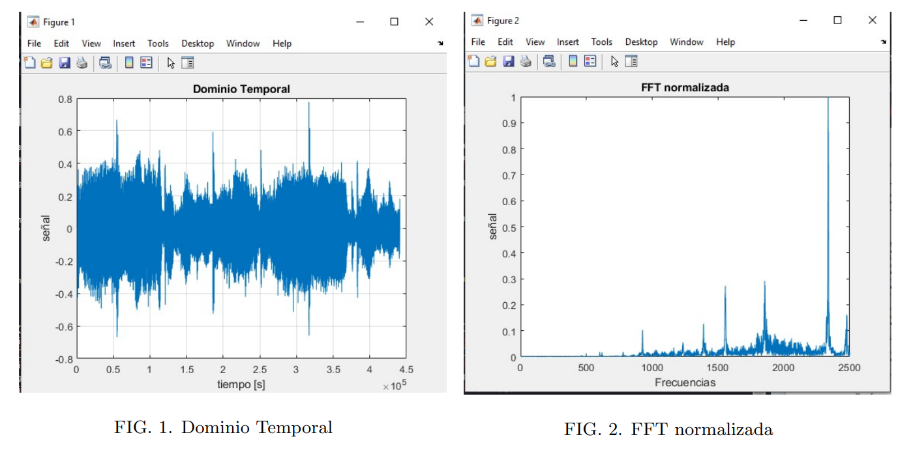

# Identificación-de-Nombre-de-Canciones
El siguiente repositorio contiene la documentación y códigos generados para la creación de un algoritmo de identificación de canciones.
Basado en la situación problema '¿Cúal es el nombre de esa canción?' del curso [Análisis de métodos matematicos para la física](https://pi-21.tecmty.com/detalle/212)

## Contenido

El repositorio está compuesto por dos carpetas principales, encontrando en 'Documentación' el reporte generado para la descripción del proyecto, el orden de ejecución del programa y el alcance del mismo. En la sección 'Código' se encuentran los archivos .m requeridos para la ejecución completa del proyecto, cabe señalar que el proyecto fue diseñado en el software [MATLAB](https://es.mathworks.com/products/matlab.html), por lo que se requerirá del software para ser capaz de ejecutarlo.

## Créditos

El proyecto busca resolver la situación problema planteada por el curso [Análisis de métodos matematicos para la física](https://pi-21.tecmty.com/detalle/212) del [Tecnológico de Monterrey](https://tec.mx/es), teniendo un objetivo exclusivamente académico. Igualmente, el proyecto fue desarrollado por un equipo asignado en el curso, por lo que el contenido creado pertenece a todos los miembros del equipo.

## Descripción General

El código tiene la función de identificar el nombre de una canción, basado en la base de datos de canciones creada previamente. El proyecto simula el funcionamiento de softwares como [Shazam](https://www.shazam.com/), basándose en el registro previo de un identificador único de las canciones disponibles en la base de datos y buscando la coincidencia de estos identificadores entre la canción a identificar y la lista disponible. Es considerado en el proyecto diferentes fases para cumplir con la identificación de la canción, siendo la captación de audio, el procesamiento de la señal, la identificación de valores representativos y el identificador; siendo estos explicados con detalle en el reporte técnico.

### Captación de Audio

Siendo considerado en el módulo **rec_song.m**, se hace uso de parámetros como la tasa de muestreo, el formato de buts y la cantidad de canales para registrar la señal de audio a identificar.

### Procesado de señal

El módulo **principal.m**, grafica la señal a lo largo de tiempo, aprovechando el módulo **separaFourer.m** para representar la señal en el dominio de frecuencias a través del comando [FFT](https://www.mathworks.com/help/matlab/ref/fft.html). La amplitud de las frecuencias es normalizada y devuelta a **principal.m** a través de una matriz de 2500 \times (número de segundos registrados). Se añade la validación de melodía, el cual a través de identificación de máximos, asegura que el registro de sonido representa una melodía y no ruido solamente.

### Identificador

Se considera la distancia temporal entre los puntos significativos considerados, limitandose a encontrar la diferencia temporales de cada frecuencia con 3 frecuecias contiguas; esto reduce el costo de almacenamiento y procesamiento considerablemente. El resultado de esto ya representa el identificador de la señal analizada.

### Creación de Base de datos

El proceso es el mismo para las canciones a considerar en la base de datos, solamente que es necesario trabajar con la mayor calidad de sonido posible para tener un identificador confiable. El módulo **crea_hash.m** genera el identificador y posteriormente se valida si este registro no fue almacenado anteriormente.

### Detección de Coincidencias

Finalmente, el módulo **rec_song.m** identifica las canciones disponibles en directorio y con ayuda del módulo **compara.m**. compara cada una de las canciones disponibles en la base con el identificador actual. Identifica el nivel de similitud entre cada registro y considerando una tolerancia, establece si hay coincidencias por cada vector de frecuencias. Devolviendo la canción con mayor similitud.

### Limitantes

- Segmentación de Sonido: El código procesa la canción a través de segmentaciones de 10 segundos, por lo que no es capaz de analizar el residuo de una canción. Por ejemplo, solo registraría los primeros 60 segundos de una canción de 63 segundos.
- Existencia en base de datos: Es necesario crear el identificador primero para ser capaz de compararlo con el registro. Si se prueba con una canción que no sea parte de la base de datos, se identificará la canción con mayor similitud.
- Almacenamiento: Existen áreas de oportunidad en la optimización del código que dificultarían su replicación a gran escala.
- Tolerancias: Multiples asunciones son hechas en el código, simplificación de procesos, aplicación de intervalos y más consideraciones que terminan por establecer una probabilidad de éxito y no una predicción completa.

## Conclusión

El objetivo de este proyecto fue el entendimiento de los procesos requeridos en el procesamiento de sonido y la manera en la que el ser humano ha creado soluciones cotidianas a partir de fundamentos matemáticos. Se entendió una parte del camino que el ser humano ha tomado para resolver los problemas que se presentan, apoyándose de hechos y contribuciones pasadas para dar soluciones cada vez más complejas.
